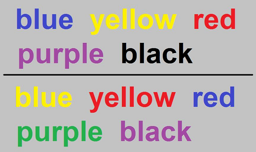

## Stroop Effect Analysis

Stroop  Effect is a psychological phenomenon illustrating the difference in the nature of automatic processing by the brain  and that of conscious visual control.J. Ridley Stroop who discovered this phenonmenon, when subjects were asked to read aloud the list of  words of colors where the name of the color and ink color of the name were the same.Bringing in a twist to the reading task, subjects were asked to read aloud the ink color of the word rather than the word itself.Here the ink color and name of the color was different. The subject took a longer time to respond in the second task ,highlighting the interference in the processing there by slowing the reaction time in the response.

## Objectives

- Report Descriptive statistics of the sample dataset
- Set up Hypothesis
- Provide Visualizations 
- Perform Statistical test
- Draw conclusions

## Software Requirements

This project requires **Python 3.x** and the following Python libraries installed:

- [NumPy](http://www.numpy.org/)
- [Pandas](http://pandas.pydata.org/)
- [Matplotlib](http://matplotlib.org/)
- [Seaborn](https://seaborn.pydata.org/)
- [SciPy](https://www.scipy.org/)
